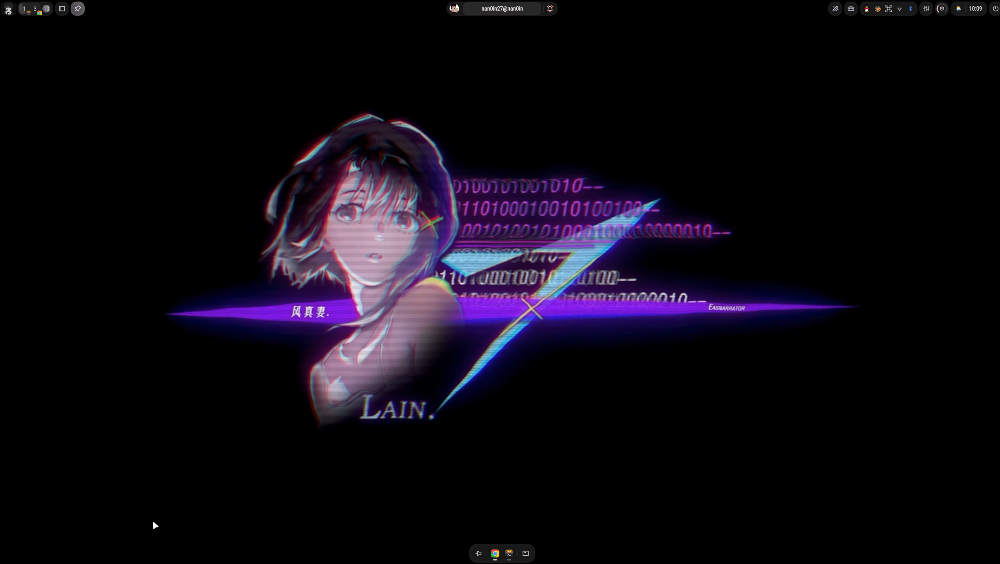

# nan0in_dotfiles

> [!IMPORTANT]
> 已经重装3次Arch Linux

nan0in's dotfiles for Arch Linux — **Hyprland + KDE Plasma** 双桌面环境.
使用 [GNU Stow](https://www.gnu.org/software/stow/) 管理配置文件，通过符号链接让 `$HOME` 下的文件直接指向此仓库，编辑即追踪。

## 目录

- [快速安装](#快速安装)
- [Stow 包结构](#stow-包结构)
- [收集与管理配置文件](#收集与管理配置文件)
- [依赖清单](#依赖清单)
  - [桌面环境 (Hyprland)](#桌面环境-hyprland)
  - [基础工具](#基础工具)
  - [Shell](#shell)
  - [终端](#终端)
  - [tmux](#tmux)
  - [编辑器 (Neovim)](#编辑器-neovim)
  - [输入法](#输入法)
  - [文件管理](#文件管理)
- [ambxst (窗口装饰与面板)](#ambxst-窗口装饰与面板)
- [配置说明](#配置说明)
  - [Hyprland (窗口管理器)](#hyprland-窗口管理器)
  - [Waybar (状态栏)](#waybar-状态栏)
  - [Dunst (通知)](#dunst-通知)
  - [Kitty (终端)](#kitty-终端)
- [截图](#截图)
- [常用软件](#常用软件)
- [License](#license)

## 快速安装

```bash
git clone git@github.com:nan0in/nan0in_dotfiles.git ~/projects/nan0in_dotfiles
cd ~/projects/nan0in_dotfiles
bash install.sh
```

脚本会把 `config`、`fcitx5`、`home` 三个包 stow 到 `$HOME`，并从 `.zshrc.secrets.example` 生成 `~/.zshrc.secrets`（填入你的 API key 等敏感值）。

> `theme/` 包含 SDDM/grub 主题，需要 root 权限手动安装，不在脚本范围内。

### 单独 stow / unstow 某个包

```bash
bash install.sh stow config          # 只链接 config 包
bash install.sh unstow home          # 只移除 home 包的符号链接
bash install.sh restow config        # 重新链接（结构调整后使用）
bash install.sh status               # 查看各包链接状态
bash install.sh list                 # 列出所有可用包
bash install.sh --dry-run install    # 预览将要执行的操作
```

## Stow 包结构

| 包 | Stow 目标 | 内容 |
|---|---|---|
| `config/` | `~/.config/` | **Hyprland**, **Waybar**, **Dunst**, **Kitty**, Neovim (LazyVim), Ranger, Yazi, fontconfig |
| `fcitx5/` | `~/.local/share/fcitx5/` | fcitx5 blog-dark 主题及输入法配置 |
| `home/` | `~/` | `.zshrc`, `.p10k.zsh`, tmux 配置 (`.tmux.conf` + 插件) |
| `theme/` | `/usr/share/` | SDDM / grub 主题（需 **root** 权限，手动安装） |
| `ambxst/` | `~/.local/src/ambxst/` | ambxst 源码魔改版（stow 自动链接） |
| `config/.config/ambxst/` | `~/.config/ambxst/` | 用户运行时配置（config 包内） |

### config 包内各模块

```
config/.config/
├── hypr/           # Hyprland 窗口管理器
│   ├── hyprland.conf        # 主入口（按顺序 source 各模块）
│   ├── conf.d/              # 模块化配置（env, monitors, binds, rules, …）
│   ├── scripts/             # 辅助脚本（托盘恢复、额外快捷键注册）
│   ├── dms/                 # DMS 主题模块
│   └── lua/                 # 实验性 Lua 配置
├── waybar/         # 状态栏
│   ├── config               # waybar 配置
│   ├── style.css             # 样式（Catppuccin 配色）
│   └── scripts/              # 自定义脚本（playerctl、录屏状态）
├── dunst/          # 通知守护进程
│   ├── dunstrc               # 主配置
│   └── dunstrc.d/            # Catppuccin 主题
├── kitty/          # 终端模拟器
│   ├── kitty.conf            # 主配置
│   └── *.conf                # 主题变体（dracula, translucent, opaque, dank）
├── ambxst/         # ambxst 面板配置 + 预设
├── nvim/           # Neovim (LazyVim)
├── ranger/         # 文件管理器
└── fontconfig/     # 字体配置
```

## 收集与管理配置文件

### 初次收集（--adopt 方法）

参考 [chaneyzorn](https://github.com/chaneyzorn/dotfiles?tab=readme-ov-file) 的方法：

1. 在 home 目录下创建 stow 目录：`mkdir ~/projects/nan0in_dotfiles`
2. 在 stow 目录下按包分类创建子目录，如 `mkdir -p nan0in_dotfiles/config/.config/hypr`
3. 将真实配置文件拷贝到对应子目录
4. 运行 `stow --adopt config` — 会将 `$HOME` 下同路径的文件**移动**到 stow 目录并创建符号链接
5. 用 `git commit` + `git checkout` 选择性保留或回退变更

### Stow 常用操作

| 命令 | 说明 |
|---|---|
| `stow -d <dir> -t <target> <pkg>` | 从 `<dir>` 将 `<pkg>` 链接到 `<target>` |
| `stow -D <pkg>` | 移除 `<pkg>` 的所有符号链接 |
| `stow -S <pkg>` | 创建 `<pkg>` 的符号链接 |
| `stow -R <pkg>` | 移除后重新创建（结构调整后使用） |
| `stow --adopt <pkg>` | 将已有文件移入 stow 并创建符号链接 |

> **冲突处理**：当目标文件已存在时，可手动删除或使用 `--adopt` + git 操作处理。

## 依赖清单

### 桌面环境 (Hyprland)

```bash
# 窗口管理器 & 核心组件
sudo pacman -S hyprland xdg-desktop-portal-hyprland qt5-wayland qt6-wayland

# 状态栏 & 应用启动器
sudo pacman -S waybar wofi

# 通知守护进程
sudo pacman -S dunst libnotify

# 壁纸管理
sudo pacman -S swww

# 截图 & 批注
sudo pacman -S grim slurp swappy

# 剪贴板管理
sudo pacman -S wl-clipboard cliphist

# 锁屏 & 登出界面
sudo pacman -S hyprlock wlogout

# 亮度 / 音量控制
sudo pacman -S brightnessctl pamixer

# 网络 & 蓝牙托盘
sudo pacman -S network-manager-applet blueberry bluetuith
```

### 基础工具

```bash
sudo pacman -S stow git lazygit
```

### Shell

```bash
# oh-my-zsh
sh -c "$(curl -fsSL https://raw.githubusercontent.com/ohmyzsh/ohmyzsh/master/tools/install.sh)"
# 插件
git clone https://github.com/zsh-users/zsh-autosuggestions ~/.oh-my-zsh/custom/plugins/zsh-autosuggestions
git clone https://github.com/zsh-users/zsh-syntax-highlighting ~/.oh-my-zsh/custom/plugins/zsh-syntax-highlighting
# p10k 主题
git clone --depth=1 https://github.com/romkatv/powerlevel10k.git ~/.oh-my-zsh/custom/themes/powerlevel10k
# 美化工具
sudo pacman -S fortune-mod cowsay lolcat fastfetch
# ls 替代 & 路径跳转
sudo pacman -S eza zoxide
# uv Python 包管理器
curl -LsSf https://astral.sh/uv/install.sh | sh
```

### 终端

```bash
sudo pacman -S kitty
```

### tmux

```bash
sudo pacman -S tmux xclip       # xclip 用于系统剪切板集成
# 插件管理器 & 插件
git clone https://github.com/tmux-plugins/tpm ~/.tmux/plugins/tpm
git clone https://github.com/tmux-plugins/tmux-resurrect ~/.tmux/plugins/tmux-resurrect
git clone https://github.com/tmux-plugins/tmux-sensible ~/.tmux/plugins/tmux-sensible
git clone https://github.com/dracula/tmux ~/.tmux/plugins/dracula
# tmux-thumbs（需要 Rust）
sudo pacman -S rust
git clone https://github.com/fcsonline/tmux-thumbs ~/.tmux/plugins/tmux-thumbs
~/.tmux/plugins/tmux-thumbs/tmux-thumbs.sh
# 安装后在 tmux 中按 prefix + I 加载所有插件
```

### 编辑器 (Neovim)

```bash
sudo pacman -S neovim make cmake   # avante.nvim 需要 cmake
yay -S kd                          # nan0in-plugins.lua 中的翻译工具
# 字体：Maple Mono NF CN
mkdir -p ~/.local/share/fonts/MapleMono
curl -L -o /tmp/MapleMono-NF.zip https://github.com/nan0in/maple-font/releases/download/v1773727790/MapleMono-NF.zip
unzip -o /tmp/MapleMono-NF.zip -d ~/.local/share/fonts/MapleMono/
fc-cache -fv
```

### 输入法

```bash
sudo pacman -S fcitx5 fcitx5-chinese-addons fcitx5-configtool fcitx5-qt fcitx5-gtk
```

### 文件管理

```bash
sudo pacman -S yazi ranger btop
# yazi 预览
sudo pacman -S chafa ffmpegthumbnailer poppler
yay -S resvg
# yazi 插件：进入 yazi 后运行 ya pkg install
```

### 其他工具

```bash
# Go 版本管理
bash < <(curl -s -S -L https://raw.githubusercontent.com/moovweb/gvm/master/binscripts/gvm-installer)
# Node.js 版本管理
curl -o- https://raw.githubusercontent.com/nvm-sh/nvm/master/install.sh | bash
# Python 环境 (miniforge3)
curl -L -O "https://github.com/conda-forge/miniforge/releases/latest/download/Miniforge3-$(uname)-$(uname -m).sh"
bash Miniforge3-$(uname)-$(uname -m).sh
# 音乐
yay -S go-musicfox
```

## 配置说明

### Hyprland (窗口管理器)

配置文件入口为 `hyprland.conf`，按顺序加载各模块：

```
hyprland.conf
├── 00-vars.conf       # 基础变量（$mainMod, $terminal 等）
├── 10-env.conf        # 环境变量（XDG, GTK, QT, fcitx5）
├── ambxst generated   # 自动生成的窗口装饰主题
├── 20-monitors.conf   # 显示器配置
├── 30-startup.conf    # exec-once（waybar, dunst, swww 等）
├── 40-input.conf      # 键盘、鼠标、触控板
├── 45-colors.conf     # DMS 颜色变量 + groupbar 着色
├── 50-look.conf       # 外观（圆角、间距、模糊）
├── 55-animations.conf # 动画效果
├── 60-binds.conf      # 快捷键
├── 70-rules.conf      # 窗口规则
└── 90-local.conf      # 本机覆盖（临时测试用）
```

- **快捷键**：主修饰键为 `SUPER`（Windows 键）
- **终端**：`SUPER + Return` → kitty
- **应用启动器**：`SUPER + D` → wofi
- **ambxst 面板**：`SUPER + SHIFT + C` 打开配置面板
- **托盘恢复**：`SUPER + SHIFT + B`（执行 `~/.config/hypr/scripts/recover-tray.sh`）
- 更多快捷键见 `conf.d/60-binds.conf`

### Waybar (状态栏)

- 配置：`waybar/config`
- 样式：`waybar/style.css`（Catppuccin Mocha 配色）
- 自定义模块：
  - `scripts/playerctl/playerctl.sh` — 媒体播放控制
  - `scripts/wlrecord.sh` — 录屏状态指示

### Dunst (通知)

- 主配置：`dunstrc`
- 主题切换：`dunstrc.d/` 下的 Catppuccin 四变体（Latte / Frappe / Macchiato / Mocha）
- Hyprland 子地图通知：`dunstrc.d/00-hyprland-keybind-submap.conf`

### Kitty (终端)

- 主配置：`kitty/kitty.conf`
- 主题变体：
  - `dracula.conf` — Dracula 配色
  - `translucent.conf` — 半透明背景
  - `opaque.conf` — 不透明背景
  - `dank-tabs.conf` — Dank Neon 标签页主题
  - `dank-theme.conf` — Dank Neon 配色
  - `background.conf` — 独立背景配置
  - `diff.conf` — diff 高亮配色

## ambxst (窗口装饰与面板)

[ambxst](https://github.com/nan0in/ambxst) 是基于 Quickshell 构建的 Hyprland 桌面面板，提供：
- 毛玻璃液态窗口装饰
- 配色方案预设切换
- 工作区管理、启动器、系统托盘

本仓库包含 ambxst 的**用户配置**和**源码魔改补丁**。

### 仓库中的 ambxst 文件

| `ambxst/`（stow 包） | 完整 ambxst 源码（stow 到 `~/.local/src/ambxst/`） |
| `config/.config/ambxst/` | 用户运行时配置 |

### 魔改内容

- **CompositorTomlWriter**：重新启用 `ignore_alpha` layerrule 生成（Hyprland 0.54+ 支持）
- **CompositorConfig**：增加 `blurExplicitIgnoreAlpha` / `blurIgnoreAlphaValue` 字段
- **GlobalShortcuts**：托盘恢复快捷键 `SUPER+SHIFT+B`
- **ThemePanel**：UI 调整，支持字体设置
- **其他**：`wal_sync.py` pywal 配色同步脚本

### 新机器安装

```bash
# ambxst 源码已包含在 dotfiles 中，由 install.sh 自动 stow 到 ~/.local/src/ambxst/
cd ~/.local/src/ambxst && bash install.sh
```

无需额外 clone 或 apply patch，clone dotfiles 即包含完整魔改版 ambxst 源码。

### 预设切换

在 ambxst 面板中 `SUPER+SHIFT+C` → 选择预设。当前预设保存在 `~/.config/ambxst/presets/active_preset`。

## 截图

### 桌面 (Hyprland+ambxst)



### 桌面 (KDE Plasma)

终端: kitty，Shell: oh-my-zsh + powerlevel10k，字体: Maple Mono NF CN

### 输入法

fcitx5 + blog-dark 主题（Tokyo Night 毛玻璃磨砂暗色）


### tmux


### Neovim (LazyVim)

- antigravity for vibe coding
- opencode / oh-my-opencode / codex
- cc-switch 配色切换


## 常用软件

| 工具 | 用途 |
|---|---|
| wps-office | 替代 Microsoft Office |
| draw.io | 绘图 |
| drawpen | 快速批注 |
| goldendict | 字典 |
| IMHEX | 十六进制编辑器 (类 010editor) |
| yazi / ranger | 文件管理 |
| btop | 进程管理 |
| virt-manager + qemu/kvm | 虚拟机 |
| VLC | 视频播放 |
| [go-musicfox](https://github.com/go-musicfox/go-musicfox) | 命令行音乐 |
| xiling vivado | FPGA 开发 |
| [思源笔记](https://github.com/siyuan-note/siyuan)| 主笔记软件| 
| meld | 文件diff工具 |

## License

MIT  

